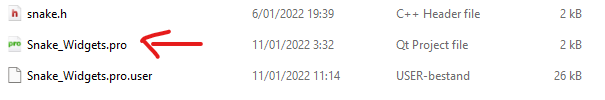
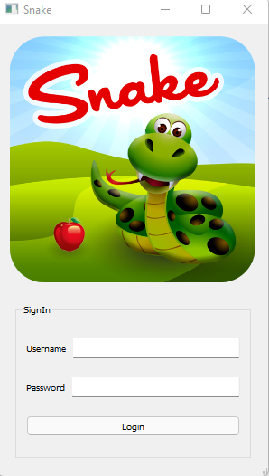
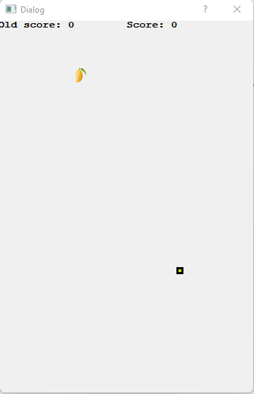
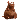

# Game_Project_C++

## Introduction
Hier komt direct de bullshit

## Beginner guide to open a project in QT

Click to expand the Beginner Guid 
 

  **Step by step guide**
  * Install Qt on your desktop.
  * Here is the link to download Qt: https://www.qt.io/download
  * Download the folder Object_Oriented_Project in Github as zip.
  * Zip the folder on you computer and make sure every file is in de same folder
  * Open the folder Project_Snake
  * Open the Snake_Widgets.pro with QT
  

## Game Instructions
 
 

Click to expand the Game folder
 
  
  **Step by step guide**
  * Press play in QT and A login (main window) window will appear.
  * You have give the username and password otherwise it won't open the game window.
  
  

  
  * username = Snake and password = Snake.
  * If you enter the correct username and password a messagebox will appear.
  
  * Now the Game (Dialog) window will appear.
  
  

  
   * Press space to start the game.
   * To move the snake you can press the arrow key.
   * On the left and right sight you can see the old score and new score of the player.
   * There are 3 types friut in the game and each of them give the player different score based on the difficulty.
  
  

  
  * The first one is cherry and it gives you 1 point and it appears most of the time (30%)
  
  

  
  * The second one is a mango and it gives you 2 point and it appears (15%) in the game.
  
  

  
  * The last one is a mouse the favourite of the snake and it give you 4 points and only appears (5%).
  
  **Note:**
Snake only get bigger with +1 and there is a limit how big the snake can get.
When the snake get's his full sieze the game wil restart again.

 
  
  
  
  
  
  
  
  
